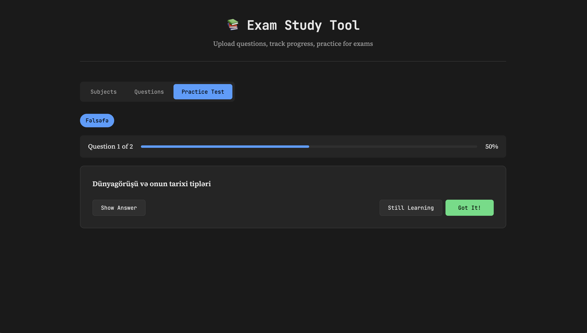

## Usage

1. Open `index.html` in your web browser
2. Create a new subject
3. Upload questions in Q: A: format
4. Track your progress and take practice tests

## Question Format

Questions should be formatted as:

```
Q: Your question here
A: Your answer here with **markdown** support

Q: Another question
A: Another answer
```

## Screenshots





## License
Free to use for personal and educational purposes.